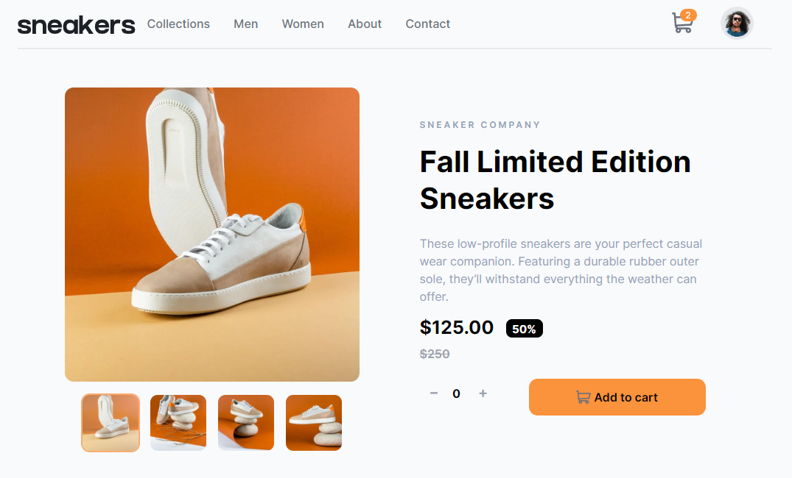
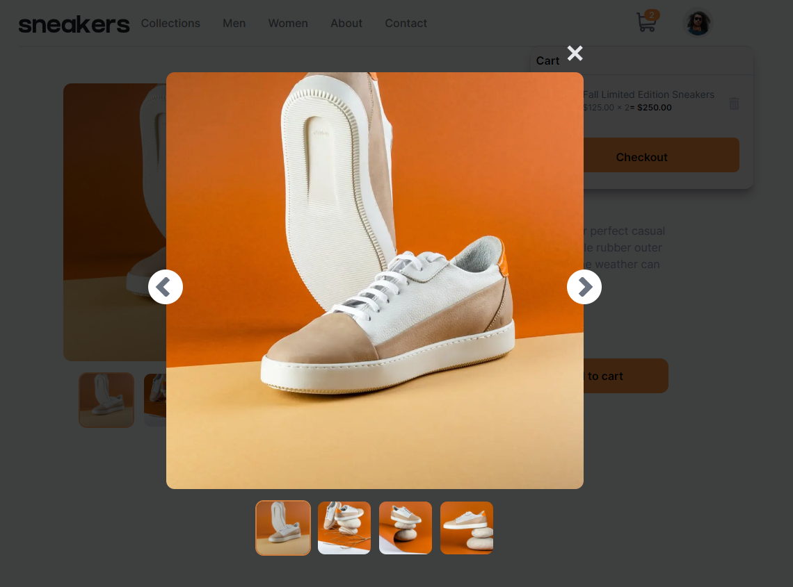
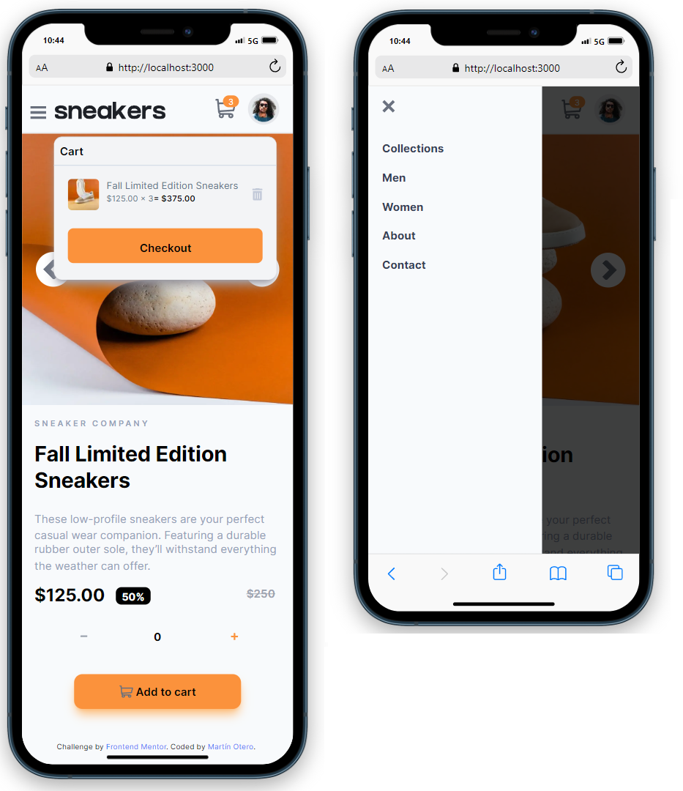

# Frontend Mentor - E-commerce product page solution

This is a solution to the [E-commerce product page challenge on Frontend Mentor](https://www.frontendmentor.io/challenges/ecommerce-product-page-UPsZ9MJp6). Frontend Mentor challenges help you improve your coding skills by building realistic projects.

## Table of contents

- [Overview](#overview)
  - [The challenge](#the-challenge)
  - [Screenshot](#screenshot)
  - [Links](#links)
- [My process](#my-process)
  - [Built with](#built-with)
  - [What I learned](#what-i-learned)
  - [Useful resources](#useful-resources)
- [Author](#author)

## Overview

### The challenge

Users should be able to:

- View the optimal layout for the site depending on their device's screen size
- See hover states for all interactive elements on the page
- Open a lightbox gallery by clicking on the large product image
- Switch the large product image by clicking on the small thumbnail images
- Add items to the cart
- View the cart and remove items from it

### Screenshot

### Links

- Solution URL: [Frontend Mentor Solution](https://www.frontendmentor.io/solutions/e-commerce-product-page-with-react-next-and-tailwind-ACXPoHtQN0)
- Live Site URL: [Vercel Deploy](https://ecommerce-product-page-omega-bay.vercel.app)

## My process

### Built with

- HTML5
- TailwindCSS
- [React](https://reactjs.org/) - JS library
- [Next.js](https://nextjs.org/) - React framework

### What I learned

The most important things that I learned in this project is the use of "context".

### Useful resources

- [Tailwind Doc Page](https://tailwindcss.com/docs/installation) - This helped me to remember a lot of things and learn new ones.

## Author

- Website - [Martín Otero Github](https://github.com/C0d3Drak3)
- Frontend Mentor - [@C0d3Drak3](https://www.frontendmentor.io/profile/C0d3Drak3)
